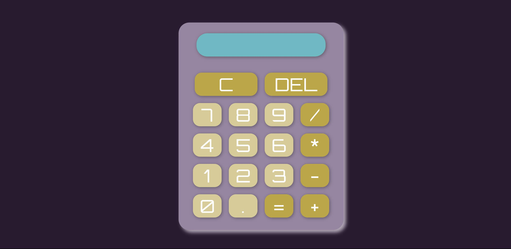
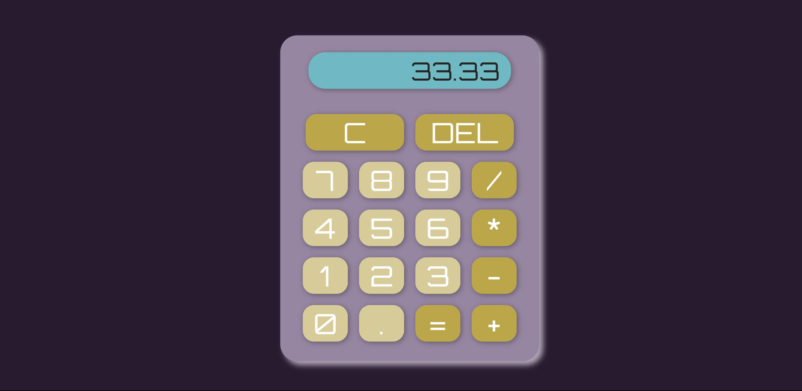

# React Calculator
React Calculator is a web application created as a learning project within the Nuclio Digital School Bootcamp of the June 2023 cohort. It allows the user to perform simple operations with a calculator.

## Table of Contents

1. Project Description
2. Platform Walkthrough
3. Technologies Used
4. Installation
6. Project Lead
   
# Project Description
React Calculator is a responsive web application that adapts to various PC screen types. It allows the users to perform simple operations like additions, subtractions, multiplications, and division on a calculator created with React. 

The frontend is built entirely with React and CSS.

This project aims to solidify the concepts studied and applied during the completed master's program.
 

# Platform Walkthrough

### Calculator
This single-page web application features an array of vibrant colors. Simple and unpretentious, users can easily perform operations by clicking on the keys. 

The keys change their color when hovered or clicked, helping users to understand what they are doing.



### Operations
Located at the top of the calculator is the display that shows the result of the operations performed. Below it, you’ll find the C and DEL buttons to delete either the last number or the entire number that has been entered.

Next, are the numbers themselves and the operators buttons. As a noteworthy detail, when performing divisions that result in periodic numbers, the display limits the decimals to two places.

Immerse yourself in the world of numbers! I hope you enjoy it!




# Technologies Used
### Main Front-End Libraries:

* React

# Installation

## 1. Configuration:

* Clone this repository to your local machine:
````
$ git clone https://github.com/Ananke85/React-Calculator.git
````
* Install project dependencies:
```
$ npm install
````
* Open a terminal and start the client:
```
$ npm run dev
````
* Open a web browser and go to the following port to view the application:
```
http://localhost:5173/
````
# Project Lead
Lorena Carmona

